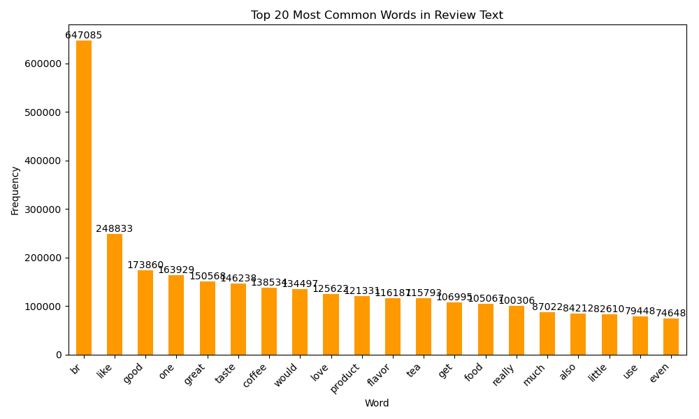
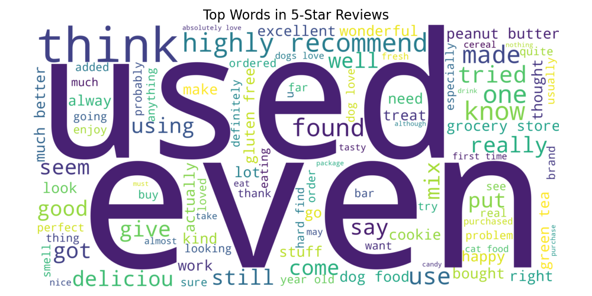

# Amazon Customer Review Sentiment Analysis

A sentiment analysis project comparing VADER (NLTK) and DistilBERT (Transformers) models on Amazon Fine Food Reviews dataset with 568,454 reviews spanning over a decade.

## Project Overview

This project performs in-depth EDA and sentiment analysis on Amazon customer reviews to understand customer satisfaction patterns, temporal trends, and compare the effectiveness of rule-based vs. transformer-based sentiment analysis approaches.

### Key Features
- **Dual Model Comparison**: VADER (rule-based) vs DistilBERT (transformer-based)
- **Large-Scale Analysis**: 568K+ reviews from 1999-2012
- **Temporal Analysis**: Quarterly sentiment trends over time
- **Comprehensive EDA**: Review patterns, user behavior, and product insights
- **Performance Evaluation**: Model agreement analysis and correlation studies

## Key Insights & Findings

### 1. Review Distribution & Patterns


**Key Finding**: 78% of reviews are 4-5 stars, indicating generally positive customer sentiment with potential selection bias toward satisfied customers in the dataset.

### 2. Sentiment-Rating Correlation


**Analysis**: Strong positive correlation between star ratings and sentiment scores across both models, validating that a higher star rating typically results in a higher sentiment score.

### 3. Temporal Sentiment Trends


**Critical Insight**: VADER shows a slightly increasing trend, suggesting that it interprets recent reviews as generally more positive. DistilBERT shows a clear decline in sentiment, indicating a growing negativity in how reviews are framed at a contextual level. This suggests either:
- Increasing customer expectations over time
- Differences in model sensitivity: DistilBERT, being context-aware, might capture subtler or more nuanced dissatisfaction
- Using different review language (e.g., sarcasm, complex phrasing) can lead to transformer models detecting sentiment more precisely than rule-based ones like VADER

### 4. Model Comparison & Agreement


**Technical Findings**:
- **Pearson Correlation**: 0.11 between models, showing a very weak linear relationship between VADER and DistilBERT sentiment scores. This low correlation suggests that the models often interpret the same review differently.
- **Agreement Rate**: 22.7% within ±0.15 threshold
- **Key Difference**: DistilBERT captures contextual phrasing better, while VADER is more sensitive to explicit positive/negative words

### 5. Word Analysis Insights





**Content Analysis**: Most frequent words relate to product quality ("good", "great", "love") and descriptive terms ("taste", "flavor", "product"), indicating reviews focus on attributes of the product itself instead of service issues.

## Technical Implementation

### Models Used
1. **VADER (Valence Aware Dictionary and sEntiment Reasoner)**
   - Rule-based lexicon approach
   - Fast processing for large datasets
   - Good for explicit sentiment expressions

2. **DistilBERT**
   - Transformer-based model (distilbert-base-uncased-finetuned-sst-2-english)
   - Contextual understanding of sentiment
   - Better at detecting sarcasm and nuanced expressions

### Data Processing Pipeline
```python
# Key preprocessing steps
1. Data loading from SQLite database (568K reviews)
2. Temporal feature extraction (quarterly analysis)
3. Text cleaning and tokenization
4. Stratified sampling for DistilBERT (5K reviews)
5. Batch processing for efficient computation
```

## Performance Metrics

| Metric | VADER | DistilBERT |
|--------|-------|------------|
| Processing Speed | Fast (All 568K reviews) | Slower (5K sample) |
| Context Understanding | Limited | Excellent |
| Sarcasm Detection | Poor | Good |
| Resource/Computational Requirements | Low | High |
| Correlation with Ratings | Strong | Very Strong |

## Project Structure

```
amazon_customer_review_sentiment_analysis/
├── data/
│   ├── Reviews.csv          # Raw dataset (LFS)
│   └── database.sqlite      # SQLite database (LFS)
├── graphs/                  # Generated visualizations
├── helpers.py              # Utility functions
├── load_data_01.py         # Data loading from Kaggle
├── eda_02.py              # Exploratory data analysis
├── sentiment_analysis_03.py # Sentiment model implementation
├── analyze_sentiment_data_04.py # Comparative analysis
├── reviews_with_VADER_sentiment.csv     # VADER results
├── reviews_with_DistilBERT_sentiment.csv # DistilBERT results
└── README.md
```

## Getting Started

### Prerequisites
```bash
pip install pandas numpy matplotlib seaborn nltk transformers torch scipy scikit-learn wordcloud tqdm pandarallel swifter kaggle colorama
```

### Installation & Setup
1. **Clone the repository**
   ```bash
   git clone https://github.com/yourusername/amazon_customer_review_sentiment_analysis.git
   
   cd amazon_customer_review_sentiment_analysis
   ```

2. **Download dataset** (requires Kaggle API setup)
   ```bash
   python load_data_01.py
   ```

3. **Run exploratory data analysis**
   ```bash
   python eda_02.py
   ```

4. **Perform sentiment analysis**
   ```bash
   python sentiment_analysis_03.py
   ```

5. **Generate comparative analysis**
   ```bash
   python analyze_sentiment_data_04.py
   ```

## Dataset Information

- **Source**: Amazon Fine Food Reviews (Kaggle)
- **Size**: 568,454 reviews
- **Time Period**: 1999-2012
- **Features**: ProductId, UserId, Score, Summary, Text, HelpfulnessRatio, Timestamp
- **Review Distribution**: 1★(52K), 2★(29K), 3★(42K), 4★(80K), 5★(364K)

## Business Applications

### For E-commerce Platforms
- **Product Quality Monitoring**: Identify products with declining sentiment
- **Customer Experience Enhancement**: Understand the top pain points from negative reviews
- **Inventory Management**: Correlate sentiment with sales performance

### For Data Science Teams
- **Model Selection**: Compare rule-based vs. transformer approaches
- **Scalability Considerations**: Balance accuracy vs. computational resources
- **Feature Engineering**: Leverage temporal sentiment patterns

## Future Enhancements

1. **Advanced Models**: Implement RoBERTa, or GPT-based sentiment analysis
2. **Product-Based Sentiment**: Analyze sentiment for specific products, if there is a way to find product information from the product id from Amazon's website
3. **Real-time Pipeline**: Extend the project by integrating a real-time data ingestion pipeline using Apache Kafka to stream live reviews (e.g., from 2025 product feedback feeds). This would allow for continuous sentiment analysis and alerting for specific products or brands, allowing businesses to monitor customer feedback as it happens and respond proactively to feedback as it comes in.

## Key Takeaways

- **VADER excels** at speed and explicit sentiment detection  
- **DistilBERT is better** for contextual understanding and nuanced sentiment (ex: Sentences that use sarcasm)
- **Strong correlation** between sentiment scores and star ratings. A higher star rating results in a higher sentiment score on average.
- **Time-series analysis reveals** that transformer models detect declining satisfaction trends over time and rule-based models like VADER detect slightly increasing satisfaction trends over time. 
- **Model agreement** of only 22.7% between VADER and DistilBERT suggests they often interpret sentiment differently, offering complementary perspectives.

---

**Contact**: jasjotparmar14@gmail.com  <br>
**LinkedIn**: https://www.linkedin.com/in/jasjotparmar/  <br>
**GitHub**: https://github.com/jasjotp

*This project demonstrates advanced NLP techniques, large-scale data processing, and comparative model analysis - showcasing skills in Python, machine learning, data visualization, and business intelligence.*